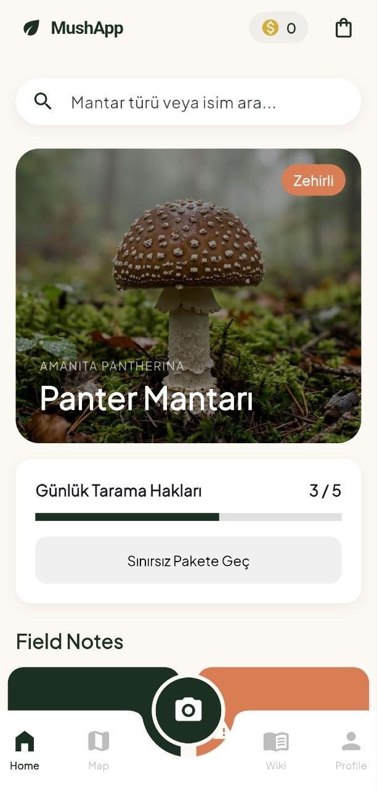
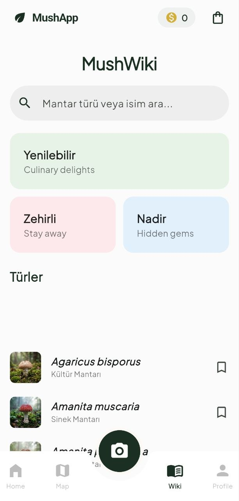
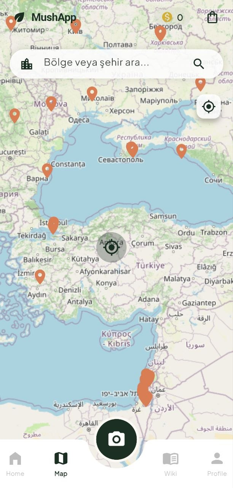
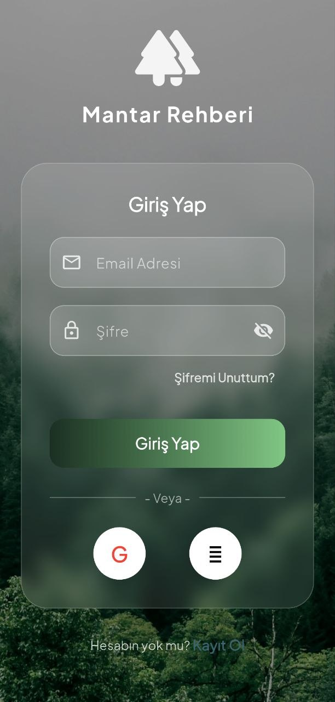
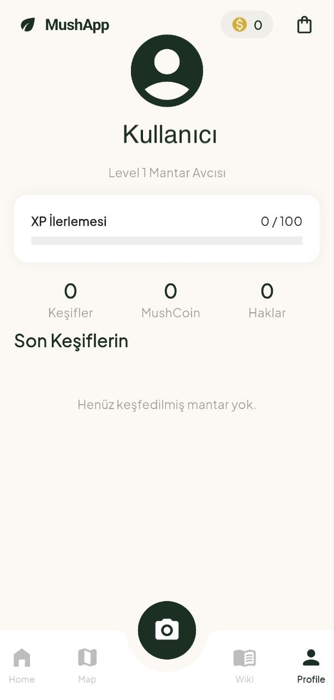
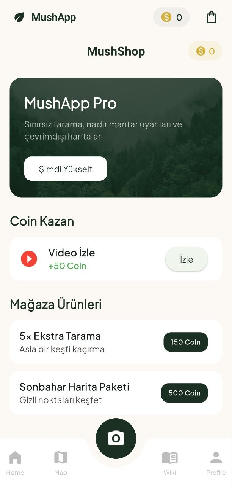
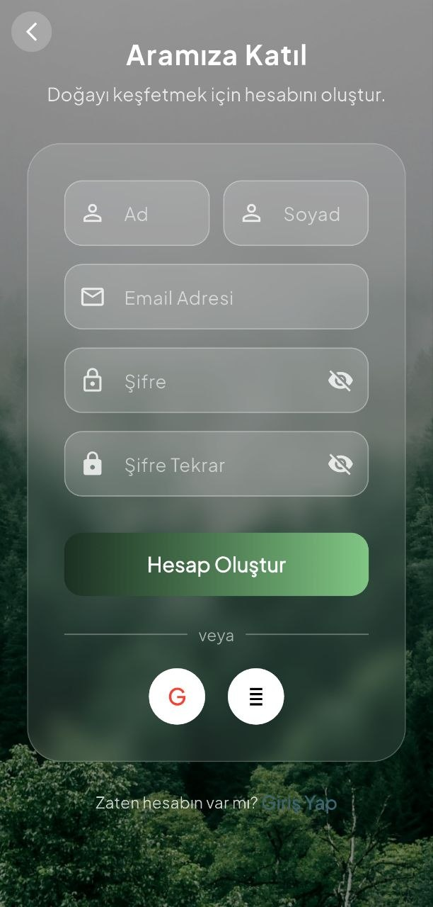
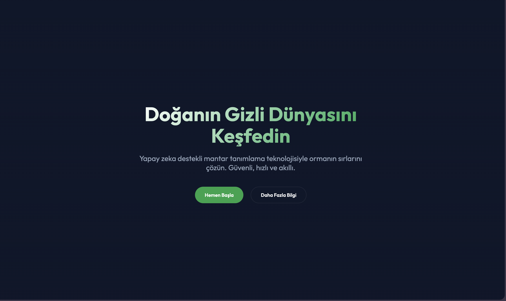

# MushApp 🍄

**MushApp** is a state-of-the-art mushroom identification and classification platform. It leverages Deep Learning to help users identify various mushroom species with high accuracy while providing a rich encyclopedia, community features, and a gamified experience.

---

## 📱 Mobile App Features

<table align="center">
  <tr>
    <td align="center"><b>Home & Dashboard</b><br></td>
    <td align="center"><b>AI Scanner</b><br></td>
    <td align="center"><b>Mushroom Wiki</b><br></td>
  </tr>
  <tr>
    <td align="center"><b>Mushroom Mapping</b><br></td>
    <td align="center"><b>Authentication</b><br></td>
    <td align="center"><b>User Profile</b><br></td>
  </tr>
  <tr>
    <td align="center"><b>In-App Store</b><br></td>
    <td align="center"><b>Registration</b><br></td>
    <td align="center"><b>Web Home</b><br></td>
  </tr>
</table>

## 🌐 Web Interface

<table align="center">
  <tr>
    <td align="center"><b>Web Landing Page</b><br></td>
  </tr>
</table>

---

## 🛠️ Technology Stack

### Mobile Frontend
- **Framework:** [Flutter](https://flutter.dev/)
- **State Management:** Provider
- **Networking:** Dio
- **Authentication:** Firebase Auth

### Backend
- **Framework:** [Django](https://www.djangoproject.com/) & Django REST Framework
- **Database:** PostgreSQL (Production) / SQLite (Development)
- **Machine Learning:** TensorFlow / Keras
- **Containerization:** Docker & Docker Compose
- **Server:** Nginx + Gunicorn

---

## 🚀 Getting Started

### Prerequisites
- Flutter SDK
- Python 3.10+
- Docker (optional, for backend deployment)

### Backend Setup (Sunucu)
1. Clone the repository and navigate to the `Sunucu` folder.
2. Install dependencies:
   ```bash
   pip install -r requirements.txt
   ```
3. Copy `.env.example` to `.env` and fill in your secrets:
   ```bash
   cp .env.example .env
   ```
4. Run migrations:
   ```bash
   python manage.py migrate
   ```
5. Start the server:
   ```bash
   python manage.py runserver
   ```

### Mobile Setup (MushApp)
1. Navigate to the `MushApp` folder.
2. Install dependencies:
   ```bash
   flutter pub get
   ```
3. (Optional) Add your `google-services.json` (Android) and `GoogleService-Info.plist` (iOS) to the respective folders.
4. Run the app:
   ```bash
   flutter run
   ```

---

## 📄 License
Copyright © 2026 Berkay Karabulut. All Rights Reserved.

This project and its source code are proprietary. Unauthorized use, reproduction, or distribution is strictly prohibited. See the [LICENSE](LICENSE) file for more details.

---

## 👥 Contributors
- **Berkay Karabulut** - *Project Owner & Lead Developer*

---
*Created with ❤️ for mushroom enthusiasts.*
